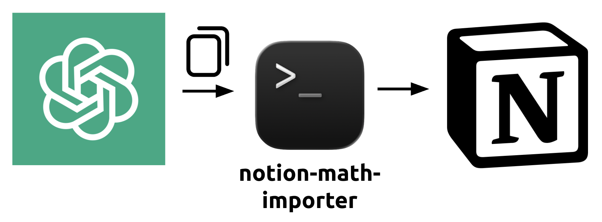

# Notion Math Importer

<p align="center">
  
</p>

Import Markdown and copied LLM responses into Notion while preserving native
inline and display equations.

The importer has two main modes:

1. Create a new child page beneath a selected Notion page.
2. Insert into an existing page, below a heading, or inside a toggle.

It supports headings, paragraphs, emphasis, links, inline and fenced code,
lists, quotes, dividers, tables, inline math, and display math.

These instructions are for macOS.

# ⚙️ Setup

## 1. Create a Notion integration

1. Open <https://www.notion.so/profile/integrations>.
2. Click **New connection**.
3. Name it `LLM Math Importer`.
4. Choose **Access token** as the authentication method.
5. Give it **Read content** and **Insert content** capabilities.
6. Copy the integration token.

Keep this token private. Never commit it to Git.

## 2. Give the integration access to Notion

1. Open the Notion page that should contain your imports.
2. Open the page menu (`•••`) and select **Connections**.
3. Find `LLM Math Importer` and add it to the page.

Access is inherited by child pages. Connecting a high-level home or notes page
is therefore convenient when all intended destinations live beneath it.

The integration cannot access unrelated pages merely linked from that hierarchy.

## 3. Install and configure

Install Node.js 18 or newer, then clone this repository and run:

```bash
cd notion-math-importer
npm install
cp .env.example .env
```

Edit `.env`:

```dotenv
NOTION_TOKEN=secret_your_internal_integration_token
NOTION_PARENT_PAGE_ID=your_default_parent_page_id_or_url
```

The `.env` file is excluded from Git.

#### What does `NOTION_PARENT_PAGE_ID` mean?

`NOTION_PARENT_PAGE_ID` is the **default parent for newly created child
pages**. It is used only in Mode 1 below.

For example, if it points to a page called `Research Notes`, every import made
without an explicit `--parent` will create a new child page beneath `Research
Notes`.

It does not need to change for every import. Keep it set to the page you use
most often. For a one-time different destination, pass `--parent`:

```bash
pbpaste | npm run import -- \
  --title "Different Destination" \
  --parent "OTHER_NOTION_PAGE_LINK"
```

## 4. Dry run

Test your install without writing to Notion.

```bash
npm run import -- --input examples/basic.md --dry-run
```

Expected output:

```text
Validated 10 blocks. Nothing was sent to Notion.
```


# 🔥 Usage

## Mode 1: Create a new Notion page

This mode creates a titled child page beneath `NOTION_PARENT_PAGE_ID`, or
beneath the page supplied with `--parent`.

### Import the clipboard

Copy an LLM response and run:

```bash
pbpaste | npm run import -- --title "Generator Matching Notes"
```

### Import a Markdown file

```bash
npm run import -- \
  --input examples/basic.md \
  --title "Generator Matching Notes"
```

### Choose a different parent for one import

In Notion, open the intended parent page and select **Copy link** from its page
menu. Then run:

```bash
pbpaste | npm run import -- \
  --title "Research Notes" \
  --parent "PASTE_PARENT_PAGE_LINK_HERE"
```

The command prints the URL of the newly created page.

## Examples

- [`examples/basic.md`](examples/basic.md) is a short sample for setup checks
  and quick dry runs.
- [`examples/kitchen-sink.md`](examples/kitchen-sink.md) exercises a broad mix
  of Markdown features, including tables, code blocks, task lists, links, and
  equations.
- [`examples/kitchen-sink-prompt.md`](examples/kitchen-sink-prompt.md) records
  the prompt used to generate the kitchen-sink response.

## Mode 2: Insert into an existing Notion page

This mode does not create a page and does not use
`NOTION_PARENT_PAGE_ID`.

You can choose among three destinations:

- A **page**: append content at the bottom of that page.
	- *Note*: Notion's API cannot see your current cursor position, so targeting a page
always appends content to the bottom.
- A **normal heading**: insert content immediately below that heading.
- A **toggle or toggleable heading**: insert content inside it.


### Get a page link

Open the destination page and choose **Copy link** from its page menu.

### Get a heading or toggle link

1. Hover over the heading or toggle.
2. Click the `⋮⋮` block handle to its left.
3. Choose **Copy link to block**.

### Import the clipboard

```bash
pbpaste | npm run import -- \
  --target "PASTE_PAGE_HEADING_OR_TOGGLE_LINK_HERE"
```

### Import a Markdown file

```bash
npm run import -- \
  --input notes.md \
  --target "PASTE_PAGE_HEADING_OR_TOGGLE_LINK_HERE"
```

No `--title` is needed because Mode 2 does not create a new page.

## Unpack an existing child page into a toggle

Copy the child page's link and the toggle's **Copy link to block** URL, then
run:

```bash
npm run unpack -- \
  --source "CHILD_PAGE_LINK" \
  --target "TOGGLE_BLOCK_LINK"
```

The source page is left unchanged so you can verify the copied content before
deleting it manually.

## Supported math formats

```text
$inline$
$$display$$
\(inline\)
\[display\]
```

Equations are validated with KaTeX before anything is written. If an equation
is invalid, the import stops and reports it.

## Safety

- `.env` and the Notion token remain local.
- New-page imports do not rewrite existing pages.
- Direct-target imports only append new blocks.
- Unpack operations leave the source page unchanged.
- No language model or third-party conversion service receives your notes.

## ☑️ To-Dos

- Ensure compatibility with Claude, Gemini, and other LLMs.
